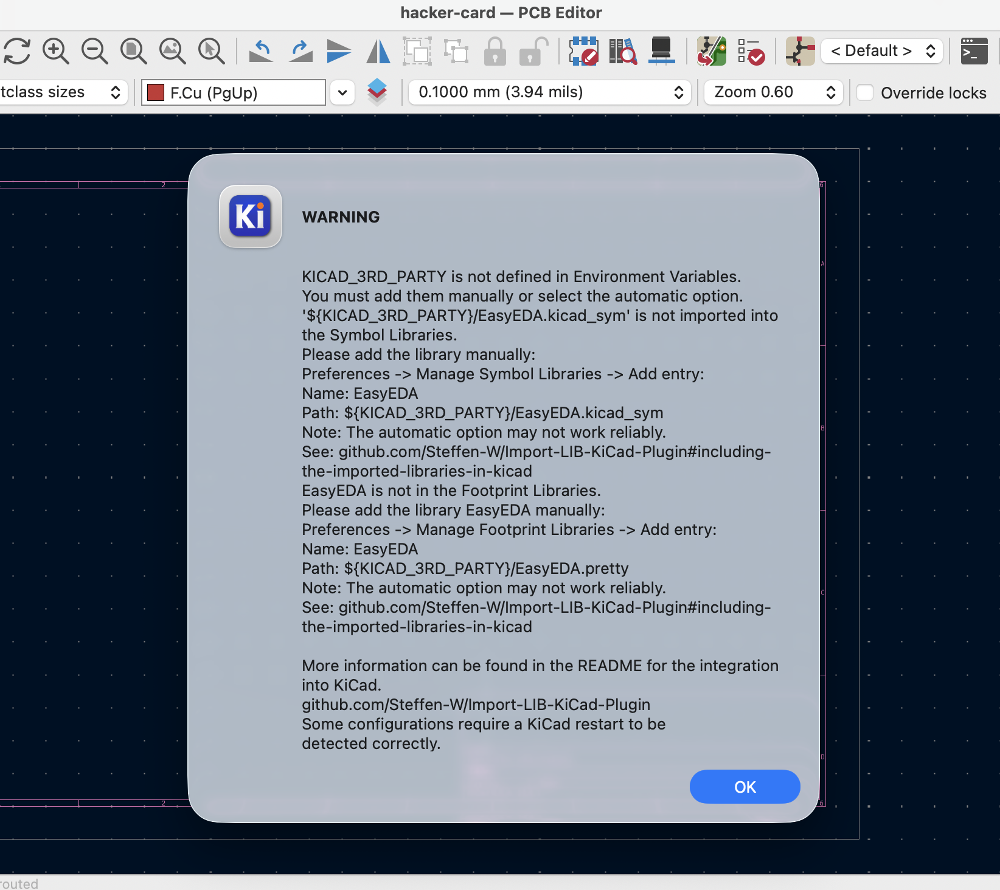
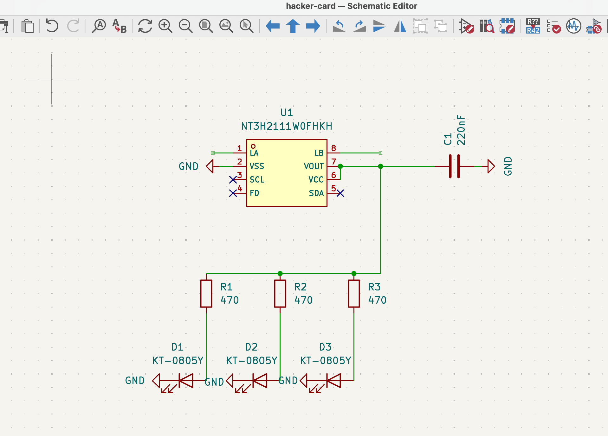

# July 29: Created the journal & set up repo

I recently heard abotu Forge and was browsing through projects and noticed that a lot of people were making their own hacker cards. Naturally, I wanted to make one for myself, maybe even add some PCB art to it if I can figure out how to lol.

The dimensions of a standard credit card are 85.6 mm x 53.98 mm x 0.76 mm so that's the size I want my card to be. I started by making a new project in kiCad. Rather than just having it be a plain PCB board, I wanted to add some leds and fake footprints to make it look a bit cooler. And ofc decorate the silkscreen to be pretty.

I was looking through Pinterest for some inspiration and found this image, which looks pretty cool! I think I want to have somet artwork on the back and then attach an NCF tag and antenna on the front with some LEDs and a port for power.

I started by figuring otu what I needed in the schematic for kicad. Just a heads up I'm I total beginner in PCB design, the only one I've created was the blinky board from Stasis, so it took me a while to figure out what I needed. I found this tutorial ([https://jams.hackclub.com/jam/hacker-card](https://jams.hackclub.com/jam/hacker-card)) from Hack Club where they used EasyEDA but I'm more familiar with kiCad from the blinky board tutorial so I just stuck to that. Something I realized after quickly reading through this writeup was that if I wanted what is called "energy harvesting", where the LEDs would light up once the phone was brought close to the NFC, I couldn't just use a regular tag, instead I would need something like a NXP NT3H2111 (a fancier NFC chip).

Anyways I made a mockup of what I wanted it to look like on Canva and then also brainstormed the parts list. Here's what I'll need:

1 ncf chip
1 antenna
3 small warm yellow LEDs
3 resistors
1 100 muf cap

And the mockup, which I'll probably end up changing as I go.

TLDR I mostly spent today figuring out what parts I need (since this is the first time I'm picking out custom ones for a project rather than following one of the Hack Club guides) and setting stuff up. Tomorrow my goal is to actually finish up the schematic. I'm still a bit confused on how to pick out the exact resistor values & cap values but I'll save that for tomorrow.

**Total time spent: 0.75 hours**

# July 30: Figured out exact parts & bom

Today, I started by figuring out the exaxct specifications for the parts I needed. The reason why I need this is because to calculate how much reseistance you need, you need to use that part's specifications. And the same goes for the capacitors.

After looking through the datasheet, specifically in the energy harvesting section, it said that a range from 150 to 220 220 nF worked, so I chose 220 nF. The HC tutorial had this value chosen as well btw.

As for the LED, after asking AI for some help in translating it (the datasheet was in Chinese), I figured out that the voltage is around 2V and and forward voltage was 1.8 V. After some basic math using Ohm's law, I found the resistance value to be around 330 ohms. But this is kind of a range so I'll switch them out during assembly based on the brightness of the leds. I then created a bill of materials CSV file with my finalized parts list.

| Amount | Component | Part | Price | Links |
| --: | ------ | ---------- | ---------- | -------------------- |
|   1 x 3 | NFC | NXP NT3H2111 HVQFN-8 | $1.93 | [Link](https://jlcpcb.com/partdetail/NXPSemicon-NT3H2111W0FHKH/C710403) |
|   3 x 3 | LEDs | KT-0805Y | $0.14 | [Link](https://jlcpcb.com/partdetail/Hubei_KENTOElec-KT0805Y/C2296) |
|   3 x 3 | resistors | 0603WAF470JT5E | $0.08 | [Link](https://jlcpcb.com/partdetail/23909-0603WAF470JT5E/C23182) |
|   1 x 3 | capacitors | **220 nF** X7R 0603 | $0.06 | [Link](https://jlcpcb.com/partdetail/21832-CL10B224KA8NNNC/C21120) |
|   1 x 3 | PCB | PCB | will get estimate later | N/A |

Total parts cost: $2.13 (not including pcb & shipping)

Note that the amounts for everything has been multiplied by 3 since I want to make three hacker cards.

Now, we can head on over to kicad to build the schematic. I'm actually going rock climbing today so I'll work on this in a couple of hours.

**Total time spent: 0.75 hours**

# July 30: Worked on getting the symbols & footprints imported

To get started I wanted to import all of the JCLPCB footprints & symbols into kicad since it isn't natively included. This lowkey took me a LONG time because I couldn't find the option to import new plugins into kicad (btw as I'm writing this I actually found it, its on the main window 😭). Apparently before you install the plugin, there's ANOTHER plugin to install that one. After reading through this ([https://github.com/Steffen-W/Import-LIB-KiCad-Plugin#use-of-the-application](https://github.com/Steffen-W/Import-LIB-KiCad-Plugin#use-of-the-application)) file, I figured out how to get it set up. Right? Wrong.

Basically, there were even more issues with the library that I had to manually fix after finally getting it installed.

So eventually I gave up on this approach and switched to trying to install eveyrthing from teh command line. That ended up working a lot better since I was able to use a library called JLC2KiCadLib to individually install the symbols for the exact parts I needed in a folder called BusinessCard_Parts. This whole process took me around an hour but at least it works right!

Then, I imported in all of the symbols and made my schematic. This took another hour because I had no idea how to wire anything. I realized that I need to wire all of the resistors in parallel so that they would stay bright, so I went ahead and did that too.

I was struggling with adding the antenna in and after reading this article (https://shanesnover.com/2022/10/06/pcb-antenna-kicad.html), I found a new process. Basically, you can leave two unconnected wires at the end of LA and LB, and later in the PCB editor, manually draw in a spiral that connects to those open connections. This is what my schematic looks like now. Tomorrow, I'll work on the PCB design, but I think I might also ask in the forge channels if anyone can sanity check it since I'm not 100% confident it'll work.

**Total time spent: 2 hours**
