# July 29: Created the journal & set up repo

I recently heard abotu Forge and was browsing through projects and noticed that a lot of people were making their own hacker cards. Naturally, I wanted to make one for myself, maybe even add some PCB art to it if I can figure out how to lol.

The dimensions of a standard credit card are 85.6 mm x 53.98 mm x 0.76 mm so that's the size I want my card to be. I started by making a new project in kiCad. Rather than just having it be a plain PCB board, I wanted to add some leds and fake footprints to make it look a bit cooler. And ofc decorate the silkscreen to be pretty.

I was looking through Pinterest for some inspiration and found this image, which looks pretty cool! I think I want to have somet artwork on the back and then attach an NCF tag and antenna on the front with some LEDs and a port for power.

I started by figuring otu what I needed in the schematic for kicad. Just a heads up I'm I total beginner in PCB design, the only one I've created was the blinky board from Stasis, so it took me a while to figure out what I needed. I found this tutorial ([https://jams.hackclub.com/jam/hacker-card](https://jams.hackclub.com/jam/hacker-card)) from Hack Club where they used EasyEDA but I'm more familiar with kiCad from the blinky board tutorial so I just stuck to that. Something I realized after quickly reading through this writeup was that if I wanted what is called "energy harvesting", where the LEDs would light up once the phone was brought close to the NFC, I couldn't just use a regular tag, instead I would need something like a NXP NT3H2111 (a fancier NFC chip).

Anyways I made a mockup of what I wanted it to look like on Canva and then also brainstormed the parts list. Here's what I'll need:

1 ncf chip
1 antenna
3 small warm yellow LEDs
3 resistors
1 100 muf cap

And the mockup, which I'll probably end up changing as I go.

TLDR I mostly spent today figuring out what parts I need (since this is the first time I'm picking out custom ones for a project rather than following one of the Hack Club guides) and setting stuff up. Tomorrow my goal is to actually finish up the schematic. I'm still a bit confused on how to pick out the exact resistor values & cap values but I'll save that for tomorrow.

**Total time spent: 0.75 hours**

# July 30: Figured out exact parts & bom

Today, I started by figuring out the exaxct specifications for the parts I needed. The reason why I need this is because to calculate how much reseistance you need, you need to use that part's specifications. And the same goes for the capacitors.

After looking through the datasheet, specifically in the energy harvesting section, it said that a range from 150 to 220 220 nF worked, so I chose 220 nF. The HC tutorial had this value chosen as well btw.

As for the LED, after asking AI for some help in translating it (the datasheet was in Chinese), I figured out that the voltage is around 2V and and forward voltage was 1.8 V. After some basic math using Ohm's law, I found the resistance value to be around 330 ohms. But this is kind of a range so I'll switch them out during assembly based on the brightness of the leds. I then created a bill of materials CSV file with my finalized parts list.

| Amount | Component | Part | Price | Links |
| --: | ------ | ---------- | ---------- | -------------------- |
|   1 x 3 | NFC | NXP NT3H2111 HVQFN-8 | $1.93 | [Link](https://jlcpcb.com/partdetail/NXPSemicon-NT3H2111W0FHKH/C710403) |
|   3 x 3 | LEDs | KT-0805Y | $0.14 | [Link](https://jlcpcb.com/partdetail/Hubei_KENTOElec-KT0805Y/C2296) |
|   3 x 3 | resistors | 0603WAF470JT5E | $0.08 | [Link](https://jlcpcb.com/partdetail/23909-0603WAF470JT5E/C23182) |
|   1 x 3 | capacitors | **220 nF** X7R 0603 | $0.06 | [Link](https://jlcpcb.com/partdetail/21832-CL10B224KA8NNNC/C21120) |
|   1 x 3 | PCB | PCB | will get estimate later | N/A |

Total parts cost: $2.13 (not including pcb & shipping)

Note that the amounts for everything has been multiplied by 3 since I want to make three hacker cards.

Now, we can head on over to kicad to build the schematic. I'm actually going rock climbing today so I'll work on this in a couple of hours.

**Total time spent: 0.75 hours**

# July 30: Worked on getting the symbols & footprints imported

To get started I wanted to import all of the JCLPCB footprints & symbols into kicad since it isn't natively included. This lowkey took me a LONG time because I couldn't find the option to import new plugins into kicad (btw as I'm writing this I actually found it, its on the main window 😭). Apparently before you install the plugin, there's ANOTHER plugin to install that one. After reading through this ([https://github.com/Steffen-W/Import-LIB-KiCad-Plugin#use-of-the-application](https://github.com/Steffen-W/Import-LIB-KiCad-Plugin#use-of-the-application)) file, I figured out how to get it set up. Right? Wrong.

Basically, there were even more issues with the library that I had to manually fix after finally getting it installed.

So eventually I gave up on this approach and switched to trying to install eveyrthing from teh command line. That ended up working a lot better since I was able to use a library called JLC2KiCadLib to individually install the symbols for the exact parts I needed in a folder called BusinessCard_Parts (committed it to my repo as well). This whole process took me around an hour but at least it works right!

Then, I imported in all of the symbols and made my schematic. This took another hour because I had no idea how to wire anything. I realized that I need to wire all of the resistors in parallel so that they would stay bright, so I went ahead and did that too. I used the hack club tutorial schematic as a reference, but I prefer using labels over having everything connected just because it makes more sense to my brain.

I was struggling with adding the antenna in and after reading this article (https://shanesnover.com/2022/10/06/pcb-antenna-kicad.html), I found a new process. Basically, you can leave two unconnected wires at the end of LA and LB, and later in the PCB editor, manually draw in a spiral that connects to those open connections. This is what my schematic looks like now. Tomorrow, I'll work on the PCB design, but I think I might also ask in the forge channels if anyone can sanity check it since I'm not 100% confident it'll work.

**Total time spent: 2 hours**

# August 1: Fixing the schematic & started PCB design!

So before finalizing my schematic, I made a couple of changes. First, I ran the Electrical Rules Checker (ERC for short) and recieved one issue, which was that "Error: Input Power pin not driven by any Output Power pins." I fixed this by adding a PWR_FLAG, similar to the X added to empty pins on the NFC tag. After running the ERC one more time it said there were no more errors so it was time to move on! I also changed the resistor values to be 150 ohms, which is a lot lower and because the resistors I had chosen before ended up being too expensive in JLCPCB.

Here's the final schematic:

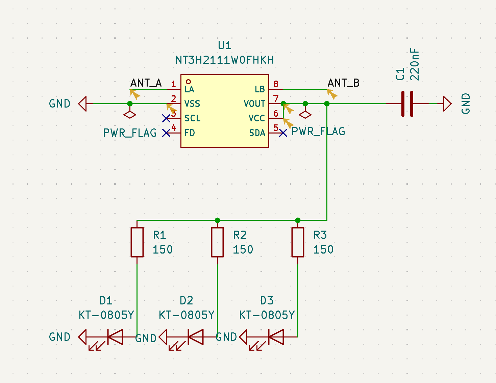

Next, I moved on to the most fun part imo, the PCB editor. I started by updating in the PCB from teh schematic and dropping the parts onto the screen. I also spaced them out a bit so that they would be easier to move around.

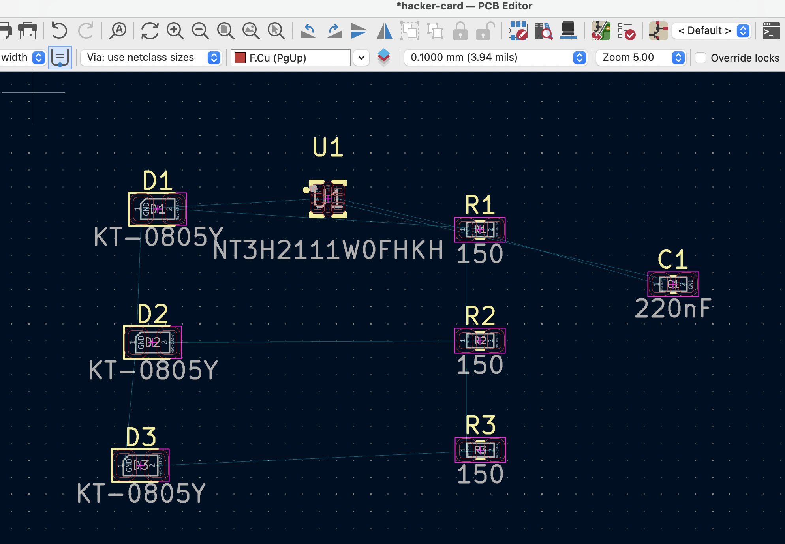

Now to actually draw out the card, I went over to the Edgecuts layer and just drew a rectangle. The dimensions of a credit card are 85.6 mm by 53.98 mm and I rounded the corners to 3 mm. That was when I realized that the electronic parts are wayyyy smaller than the actual card so they'll be easily hidden in it! Next, I decided to work on the silkscreen and actual pcb decorations. First, I went to the front of the board, and added in the text from my Canva mockup. To add in the first image on the front, what I did was convert it to an SVG. Since it was black and white I thought there wouldn't really be any problems while importing. However, when I added the image on, it was just a blank yellow block.

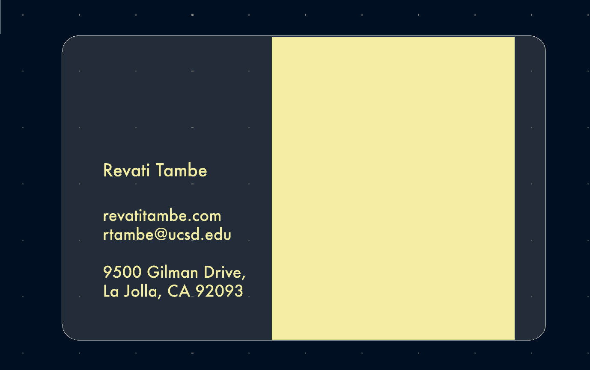

After realizing that, I tried converting the image to dxf format but that didn't seem to work either. That was when I found this tutorial ([https://community.element14.com/members-area/b/blog/posts/kicad-6---adding-logos-and-graphics-to-a-silkscreen](https://community.element14.com/members-area/b/blog/posts/kicad-6---adding-logos-and-graphics-to-a-silkscreen)) and realized kicad actually has an image converter included in the application! (What??!?) It's literally a lifesaver, but I opened up the image there and selected the output layer. It also included some tools for sharpening/blurring out the image which I played around with for a bit.

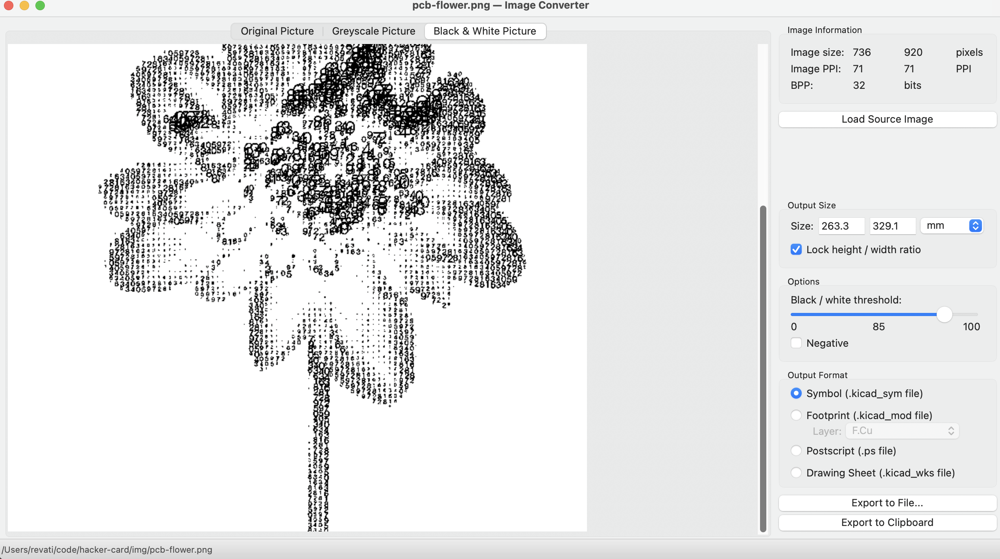

I mean you gotta love the developers for creating this! Pro tip: I initially saved this as a footprint file (.kicad_mod) but it's wayyyyy easier to just copy it to your clipboard and paste it onto your file, and play around with the sizing as needed.

Then, I moved around around the electronics footprints, specifically the LEDs, where I wanted, and this is what the board looked like after they were placed.

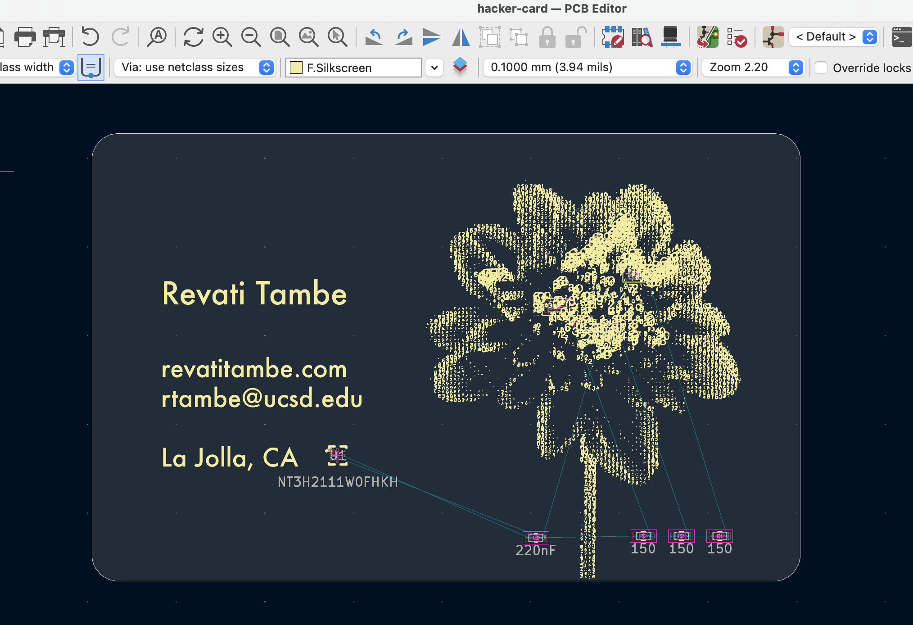

And the 3d view!

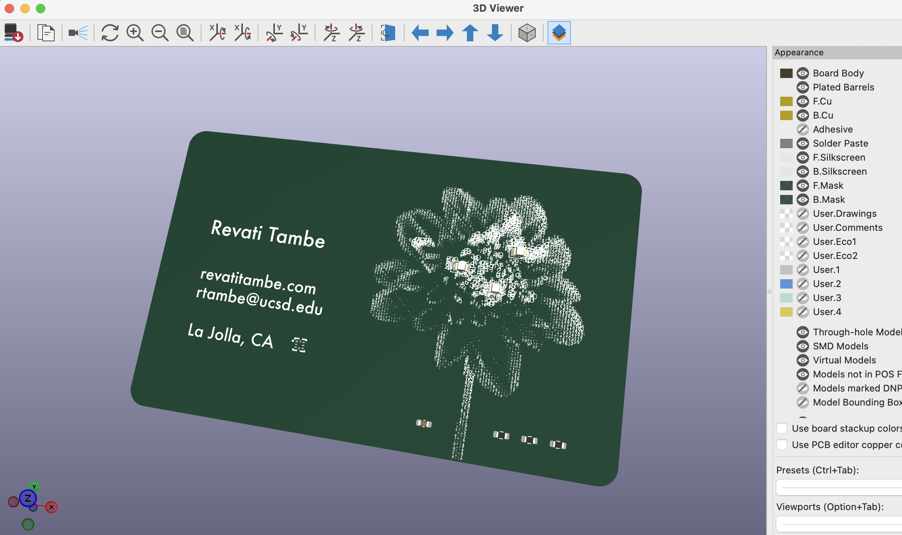

Next I moved onto my favorite part which is wiring everything up! It didn't take too long to route the tiny connections, honestly it was kind of therapeutic. Then, I moved on to wiring the antenna. I did this part differently from the hack club tutorial (they used autorouter in EasyEDA) because I had to connect the wire stubs from the schematic (in my previous journal, theyre called LA & LB) and create a trace that wrapped around the entire board manually. This took a long time, and then I realized that the antenna didn't even connect to LB :(. This is what it looked like:

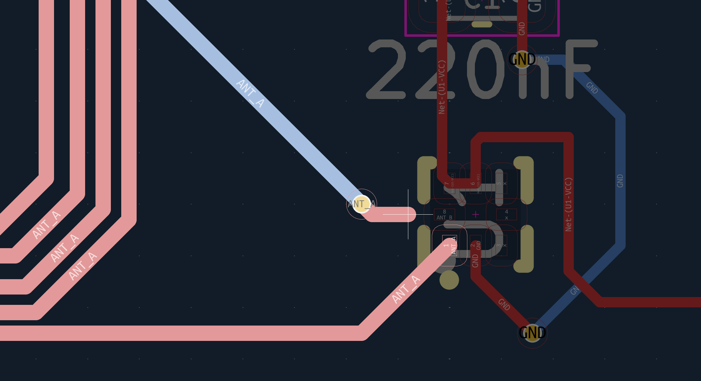

Cue clip of me crashing out after drawing the entire antenna. Anyways after taking a short break, I realized there was an error in my schematic. If you look at my final schematic, you'll see that I stupidly created ANT_A and ANT_B labels. This meant KiCad had no way to tell that they were actually supposed to connect because it would assume it'll accidentally short. So I just changed both of those labels to be ANT_A. And after updating my PCB from my schematic once again, the wiring did work. To finally check if it was all okay, I ran the DRC (Design Rules Checker) and to my surprise there weren't any errors!

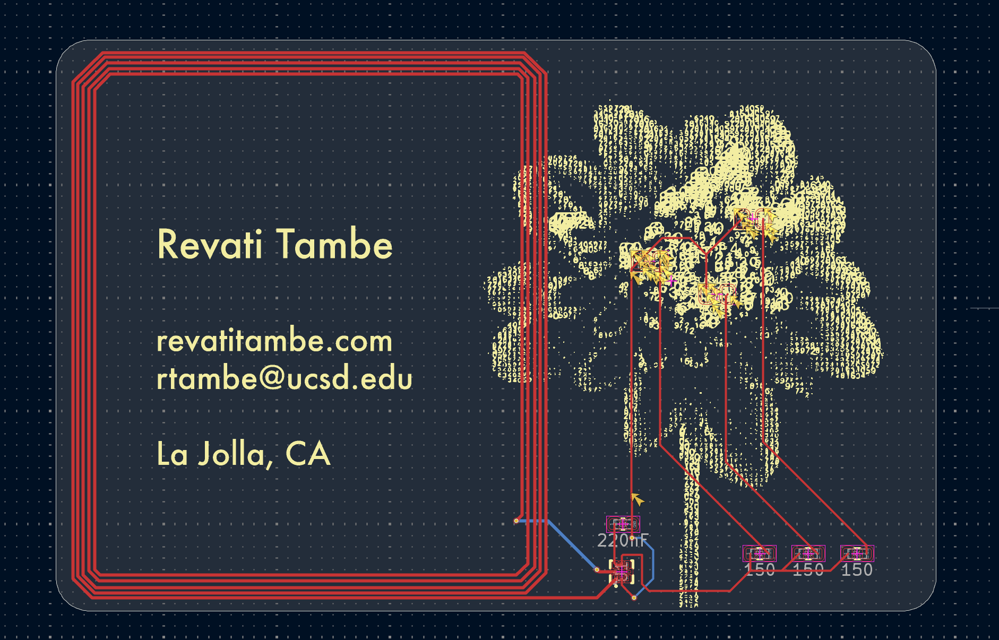

Now really all that was left was adding the art on the back of the PCB and just finishing touches! I went to B.Silkscreen and there's a really handy option called view --> flip board. I then added the image I wanted. I also resized the board to be slightly smaller (77.8 x 50.48 mm) so that it looks better visually and added a little more artwork to the front to fill in the blank spaces. Here's what the final board looks like!

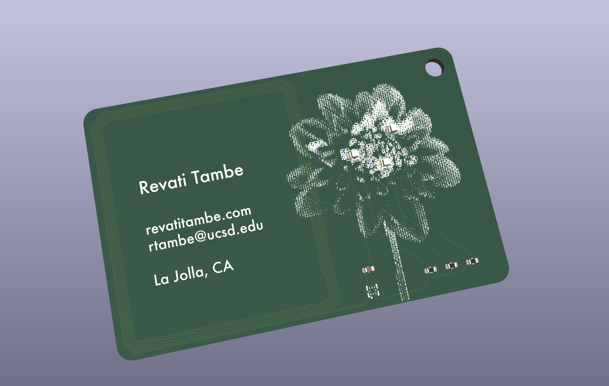
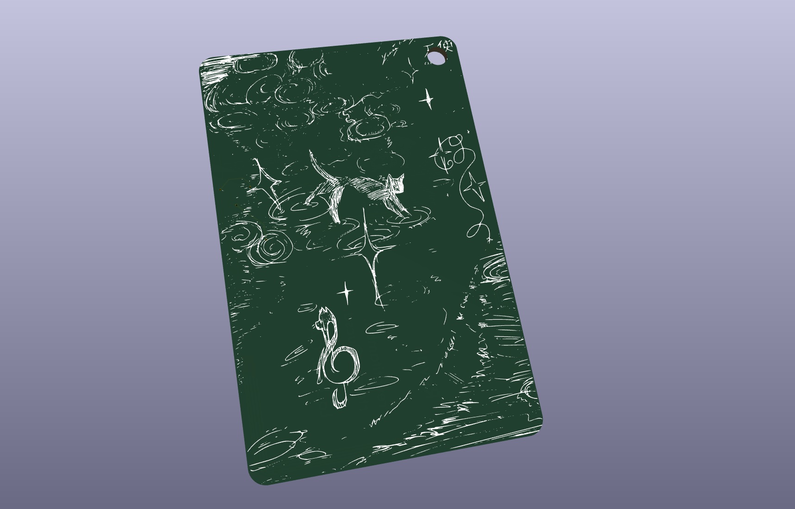

Last thing I did was try to get a price estimate for it through JLCPCB. I started by installing ANOTHER plugin for the JLCPCB fabrication toolkit. This basically generates a BOM and the gerbers for you. You can see them in the production folder of this repo. Anyways I went over and this was the final price estimate, I made sure to choose the cheapest hardware & assembly options as possible.

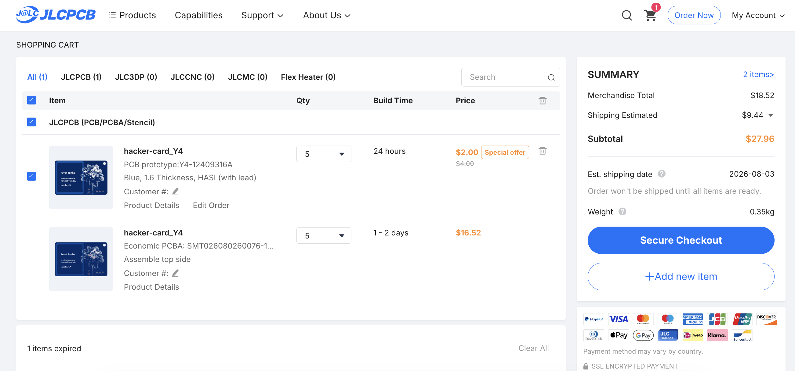

Hopefully today's journal feels a little bit more detailed than my older ones! It lowkey took a long time to document everything but Lapse always crashes my computer for some reason so I tried to add more screenshots of my entire process and to be a lot more descriptive with problems I occured and how I fixed them. I think at this point the PCB is ready for me to submit my design!

**Total time spent: 2.75 hours**

# August 1: Added a README

This is pretty self explanatory, but I quickly wrote up a README.md file as it caused my design submission check to fail. Everything else looked good in the checker. I also added a picture which was required for the submission.

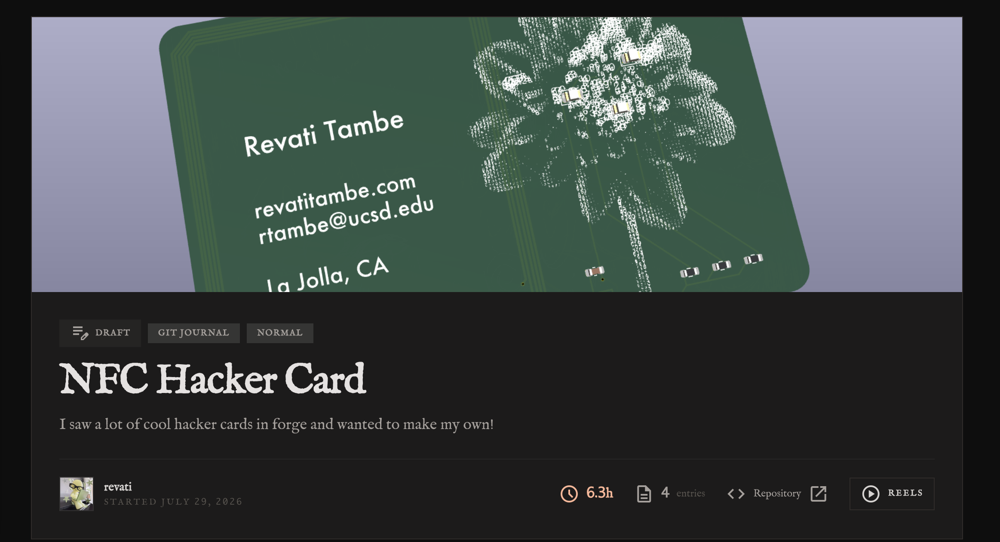

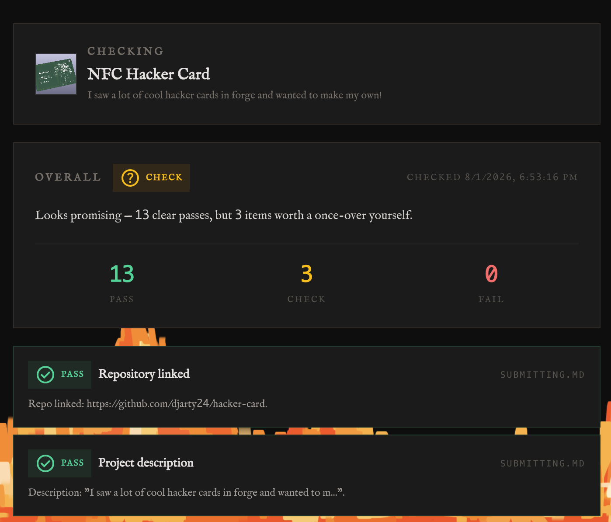

Ok now I'm actually going to submit it for design review.

**Total time spent: 0.15 hours**