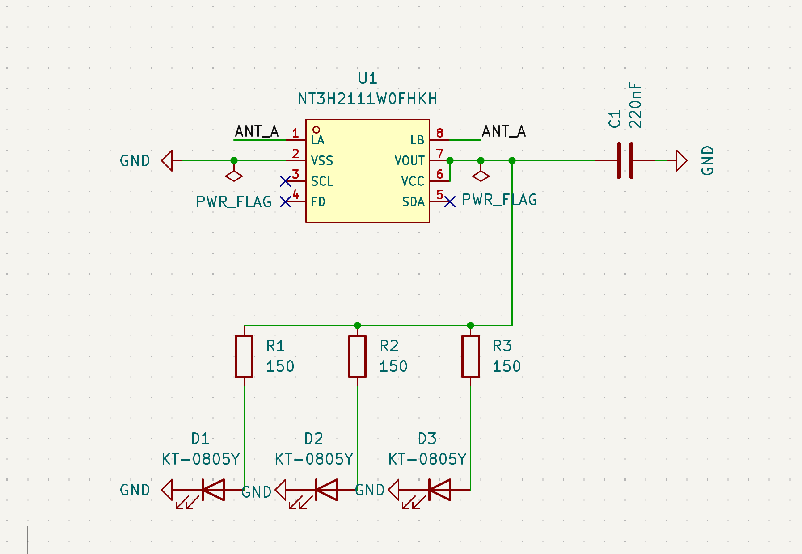

# NFC Hacker Card

This is a hacker card I made for myself!

Front of Card:

Back of Card:

### Description

I mainly used this article from Hack Club as a starting point, but my project branched out in several ways. First, I used KiCad instead of EasyEDA. I choose to add two additional LEDs, and I also manually designed the NFC antenna. I learned a lot from this project like how to pick out hardware, what energy harvesting is, reading datasheets to find the capacitor I should use, and actually doing calculations for the resistance values based on the hardware I was using and how bright I wanted the circuit to be.

### Schematic

### Final Project Cost

#### BOM
### Bill of Materials (BOM) & Cost Breakdown

| Link | Component | Footprint / Package | LCSC Part # | Qty (Total) | Total Cost |
| :--- | :--- | :--- | :--- | :--- | :--- |
| [Link](https://jlcpcb.com/partdetail/21832-CL10B224KA8NNNC/C21120) | 220nF | 0603 | C21120 | 5 | $0.0835 |
| [Link](https://jlcpcb.com/partdetail/Hubei_KENTOElec-KT0805Y/C2296) | KT-0805Y (Yellow LED) | 0805 | C2296 | 15 | $0.2280 |
| [Link](https://jlcpcb.com/partdetail/VikingTech-AR03FTC1500/C234295) | 150Ω Resistor | 0603 | C22808 | 15 | ~$0.03 |
| [Link](https://jlcpcb.com/partdetail/NXPSemicon-NT3H2111W0FHKH/C710403) | NT3H2111W0FHKH (NFC Chip) | XQFN-8 | C710403 | 5 | $3.2115 |

Please Note: The individual component costs listed above aren't completely accurate. Because I used JLCPCB for the full assembly (which was required for the specific surface-mount parts I chose and ended up being the cheapest option overall) the individual component prices don't matter as much as the final fabricated total.

#### JLCPCB Price Estimate

After submitting all of the info (gerber files, bom.csv, and positions.csv) to JLCPCB for assembly, this was the final price estimate I got.

**PCB Prototype (Fabrication):** $2.00
**Economic PCBA (Assembly):** $16.52
**Estimated Shipping:** $9.44
**Total Price:** **$27.96**

This project was made for Hack Club's Forge!
